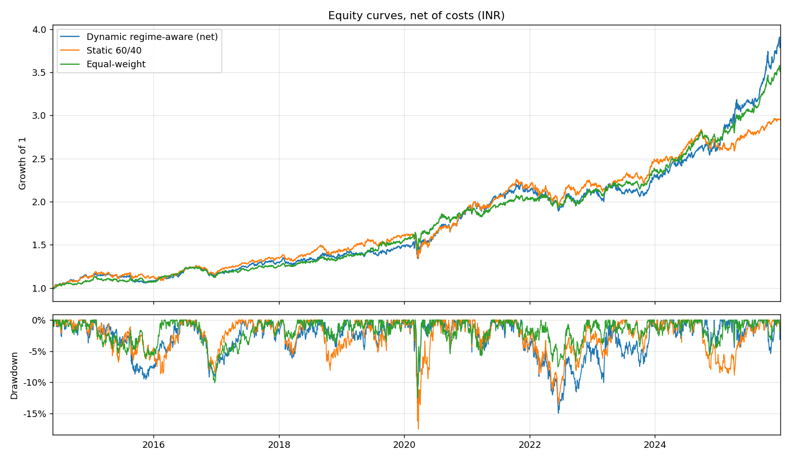
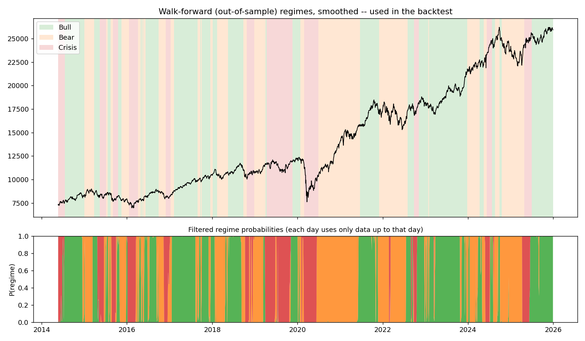

# Regime-Shift Detection using Hidden Markov Models
A regime-aware portfolio engine that detects whether the Indian market is in a **Bull**,
**Bear**, or **Crisis** state using a Hidden Markov Model, then reallocates between stocks,
gold, and bonds using convex optimization (`cvxpy`) — validated with a strict walk-forward
harness so the backtest can't cheat by peeking into the future (and a test suite that checks
it doesn't).

## Results

Out-of-sample, 23 May 2014 – 30 Dec 2025, in INR, net of 7 bps costs:

| Strategy | CAGR | Vol | Sharpe | Sortino | Max DD | Calmar | Turnover / yr |
|---|---|---|---|---|---|---|---|
| **Dynamic (regime-aware)** | **13.0%** | 10.7% | 1.20 | 1.74 | −15.0% | 0.87 | 3.30 |
| Dynamic, before costs | 13.2% | 10.7% | 1.22 | 1.77 | −14.9% | 0.89 | — |
| Static 60/40 (stocks/bonds) | 10.4% | 9.7% | 1.07 | 1.52 | −17.5% | 0.59 | 0.26 |
| Equal weight (1/3 each) | 12.2% | 8.7% | **1.37** | **2.04** | **−12.5%** | **0.98** | 0.29 |
| Nifty 50 buy & hold | 12.3% | 16.3% | 0.79 | 1.09 | −38.4% | 0.32 | — |



- **The regime strategy beats static 60/40 and Nifty buy & hold** on every risk-adjusted
  measure, and has the highest CAGR of the group.
- **It does not beat equal weight on risk.** Equal weight has the better Sharpe, Sortino,
  Calmar and max drawdown. The CAGR lead over equal weight is a single episode: at the end of
  2024 the strategy was ~3% *behind*; 2025 — ~55% average gold weight while gold rose ~74% in
  INR — put it ~8% ahead.
- **Costs are small**: ~5 rebalances a year cost ~0.3% a year.
- Sharpe/Sortino use a 0% risk-free rate, so compare them across rows, not with published figures.

### Do the regimes mean anything?
Realized Nifty volatility and return over the **next** month, grouped by the out-of-sample
regime assigned today (`outputs/regime_diagnostics.csv`):

| Regime today | Share of days | Next-month vol | Next-month return |
|---|---|---|---|
| Bull | 42% | 11.0% | +0.8% |
| Bear | 39% | 15.5% | +0.9% |
| Crisis | 19% | 19.2% | +1.5% |

The labels forecast **volatility** out-of-sample; they do not forecast **returns** — the
month after a Crisis label has had the highest average return (rebounds after sell-offs).
That matches how the optimizer uses them (regime sets risk aversion, not expected return), and
it is also the cost of the approach: de-risking in Crisis gives up some of the rebound.



## Data

Pulled via `yfinance`, snapshotted in `data/raw_prices.csv`:

| Leg | Ticker | Notes |
|---|---|---|
| Stocks | `^NSEI` | Nifty 50 (NSE), INR |
| Gold | `GC=F` | Gold futures, USD → converted to INR |
| Bonds | `IEF` | iShares 7-10Y Treasury Bond ETF, USD → converted to INR — a real **price** series |
| Vol proxy | `^INDIAVIX` | falls back to `^VIX` only if unavailable |
| FX | `INR=X` | INR per USD, used for the conversion |

**Why `IEF` and not a raw yield like `^TNX`?** A yield is not a tradable price. Using a yield
series directly as if it were a "bond price" gets the sign backwards — yields *rise* when
bond prices *fall*, so a naive substitution would make the strategy buy bonds exactly when
it should be selling them. An ETF price series (`IEF`) sidesteps that conversion issue
entirely and is treated identically to the stocks/gold legs everywhere in the pipeline.

**Why convert to INR?** The signal is Indian (Nifty, India VIX) and so is the investor it
describes. Mixing INR and USD returns in one portfolio silently ignores the currency: over
2012–2025 the rupee went from ~53 to ~90 per dollar, so for an Indian investor the dollar legs
earned that on top of their USD return — and the rupee tends to weaken exactly in the
sell-offs where the model moves into gold and bonds.

**FX data repair.** Yahoo's `INR=X` has a few one-day bad prints that fully reverse the next
day (up to 6% in Jan 2012). `clean_fx()` replaces a print more than 2% away from its centred
5-day median (4 prints in total); genuine moves persist, so they are kept. Only the FX series
is cleaned — big one-day moves in the traded assets (March 2020) are real.

## Files

| File | Purpose |
|---|---|
| `Regime_Shift_Notebook.ipynb` | **Main deliverable.** Walks through every phase top to bottom — data → features → regime detection → optimization → backtest → results — with the figures and commentary. |
| `pipeline.py` | All of the logic, one section per phase. The notebook and `run.py` both import it. |
| `plots.py` | The figures, shared by the notebook and `run.py`. |
| `run.py` | Command-line runner: saves every figure and CSV to `outputs/`. |
| `tests/test_pipeline.py` | Checks no-lookahead, portfolio accounting, smoothing, FX repair and the optimizer. |
| `data/raw_prices.csv` | Raw price snapshot, so results reproduce exactly. |
| `outputs/` | Regime overlays, equity curves, weights, transition matrices, regime diagnostics, performance summary. |

## How to run it

```bash
pip install -r requirements.txt
python run.py              # uses data/raw_prices.csv
python run.py --refresh    # re-downloads prices from yfinance first
pytest                     # ~20 s
```

For the notebook: `jupyter notebook Regime_Shift_Notebook.ipynb`, then Kernel → Restart & Run
All (run it from the repo root so it can import `pipeline.py`).

## Key decisions

**Why 3 regimes (not 2 or 4)?** Two states can't separate "steadily falling" from "violently
crashing," which is exactly the distinction that matters for tail-risk management. Four or
more states starts fitting noise given only a handful of features and a few thousand daily
observations — `n_components=3` maps directly onto the project's Bull/Bear/Crisis framing
rather than being a free hyperparameter to tune.

**Why these features?** Momentum (1w/1m/1q rolling log-return) captures *direction*;
volatility (1w/1m rolling std, annualized) captures *turbulence*; VIX level + 1-week change
adds an independent, market-implied fear signal rather than relying purely on realized stats
from the same return series the strategy trades. `covariance_type="diag"` was chosen over
`"full"` because with 7 features and a training window of ~2 years, a full covariance matrix
per state has too many parameters relative to the data and overfits.

**Why label states by volatility rank instead of by mean return?** Mean return is noisier and
regime-dependent in sign only sometimes (a slow bear grind and a violent crash can have
similar mean returns but very different variances); ranking by volatility is more stable and
economically matches "Crisis = highest turbulence." The diagnostics table above confirms the
ranking carries over out-of-sample. Labels are relative to each 2-year training window, so in
a calm stretch "Crisis" can be fairly mild in absolute terms.

**Why fit the HMM from 5 seeds?** EM only finds a local optimum. With a single seed, several
walk-forward folds landed in poor optima whose states flip every few days: ~760 regime changes
over 11 years. Keeping the best log-likelihood of 5 fits (on the training window only) cuts
that to 128.

**Why filtered decoding instead of `model.predict()`?** `predict()` runs Viterbi over the whole
63-day test window, so the label it gives day *t* depends on days *t+1 … t+62* — lookahead in
every test window even though the model never trained on them (`predict_proba()` is
forward-backward and has the same problem). `filter_states()` runs the forward algorithm one
day at a time, giving P(state on day *t* | data up to day *t*). The tests check this two ways:
tampering with future data must not move any earlier label, and each day's output must be the
same whether the decoder sees the rest of the window or not (the old Viterbi decoding fails
this on real data).

**Why walk-forward with a rolling (not expanding) window?** An expanding window means the
early folds have very little data (unstable HMM fits) while later folds are dominated by a
huge training set that drowns out recent regime shifts. A rolling 504-day (~2y) train / 63-day
(~3mo) test window keeps the HMM responsive to structural change while still giving it enough
data to fit 3 Gaussian states reliably.

**Why smooth the regime series, and why a hard `min_hold` floor?** Even well-fitted, the daily
labels chatter around regime boundaries. `smooth_regimes()` applies a ~1-month rolling majority
vote (each point only uses its own day and the past, and a tied vote keeps the current regime),
cutting 128 changes to 55. `backtest_dynamic` also enforces a hard `min_hold=21`-day floor
between rebalances, so turnover is bounded even if the smoothed series still flips near a
boundary, and a `max_hold=126`-day safety refresh keeps weights from going stale if a regime
persists for an unusually long time.

**Why per-regime risk-aversion (`gamma`) instead of a totally different objective per
regime?** A single mean-variance formulation (`maximize mu'w - gamma * w'Σw`) that just
dials `gamma` up in Crisis and down in Bull is mathematically simpler, stays convex, and
avoids having to justify three unrelated objective functions — it naturally produces
"maximize Sharpe-like behavior in Bull" and "minimize-variance-like behavior in Crisis"
as the two extremes of the same convex program.

**Why rebalance on regime change instead of a fixed monthly clock?** Rebalancing every 21
trading days regardless of whether anything changed is pure cost drag with no informational
justification. The static 60/40 and equal-weight benchmarks are still rebalanced every 21
days, since they have no signal to react to — that's the natural default schedule for a
fixed-weight portfolio, and it's held constant so the benchmarks' behavior isn't being tuned
at the same time as the strategy's.

**How the backtest does its accounting.** Every strategy goes through the same `simulate()`:
portfolio returns are weighted sums of *simple* asset returns (a weighted sum of log returns is
not the portfolio's log return); weights decided at a day's close earn from the next day;
between rebalances the weights drift with prices; and each rebalance pays 7 bps on turnover =
`sum(|target − drifted weights|)`. So the benchmarks pay for their monthly resets too.

**Why 7 bps transaction cost?** 7 bps sits in the middle of the 5–10 bps range given in the
brief. It's applied only when a rebalance actually fires.

## Limitations and next steps
- **The optimizer is the weak link.** `mu` is a trailing 63-day mean, which is mostly noise, so
  mean-variance ends up chasing recent winners and hitting the 70% cap (see
  `outputs/05_dynamic_weights.png`). Since the regimes forecast volatility, not returns, a
  natural next step is to let them drive risk directly (volatility targeting, risk parity with
  regime-dependent leverage) instead of feeding a noisy mean return into the optimizer.
- **One path, one period.** 11 years is only a handful of real crises, and one of them (2025
  gold) decides the CAGR ranking. Treat the table as evidence, not proof.
- **Not tuned — on purpose.** `gamma`, windows and holding periods are the original design
  choices; none were fitted to the backtest.

## Reproducing results
`run.py` and the notebook read `data/raw_prices.csv`, and every random step is seeded
(`RNG_SEED = 42`), so they reproduce the numbers above exactly. `python run.py --refresh`
re-downloads the same 2012–2025 range; results can shift slightly because Yahoo occasionally
revises old prints. To extend the sample, change `end` in `run.py` and refresh.
